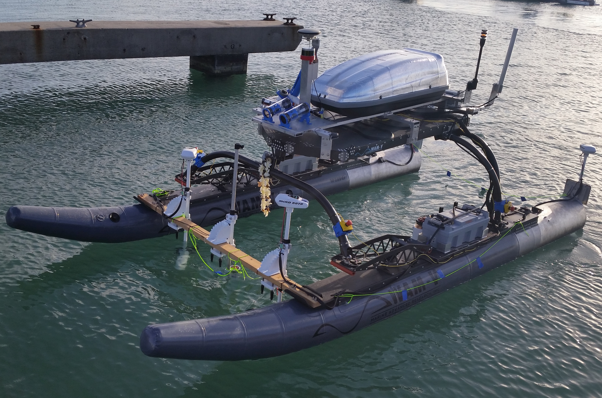

# NaviGator Autonomous Surface Vehicle

This is where all of the project specific code for [NaviGator](http://www.navigatoruf.org) hosted. The platform is designed to compete in the bi-annual [Maritime RobotX Challenge](https://www.robotx.org). For more information on project specifics, vehicle operation, or contacting the current team lead, please see the [wiki](https://github.com/uf-mil/NaviGator/wiki).

# Getting Involved

Information about getting involved in MIL is available on the [mil_common wiki](https://github.com/uf-mil/mil_common/wiki). The home page will introduce you to the various projects that are under development in the lab and provide a link to the getting started guide.

You can also join [our slack](https://uf-navigator.slack.com), which we use for communication within the team.
