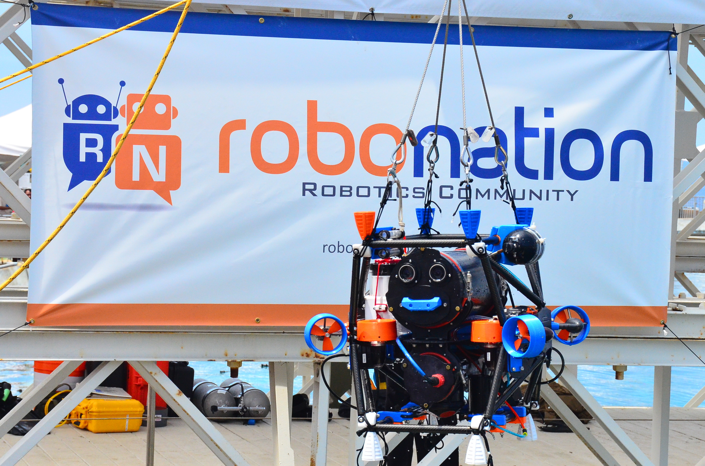

# SubjuGator Autonomous Underwater Vehicle

This is where all of the project specific code for [SubjuGator](http://subjugator.org) hosted. The platform is designed to compete in the anual [RoboSub competition](http://www.robonation.org/competition/robosub). For more information on project specifics, vehicle operation, or contacting the current team lead, please see the [wiki](https://github.com/uf-mil/SubjuGator/wiki).

# Getting Involved

Information about getting involved in MIL is available on the [mil_common wiki](https://github.com/uf-mil/mil_common/wiki). The home page will introduce you to the various projects that are under development in the lab and provide a link to the getting started guide.
