Unified Perception Interface
============================

Marshall Rawson

Abstract
********

Unified Perception Interface is a centralized point that all low level perceptions about the world pass through and
are combined together to try and generate an accurate model of the world

Motivation
**********

In MIL, we generally have 2 levels of perception:

* Low level -> Where is the thing I am looking for in the image / how far in front of me

* High level -> How should I move the robot according to where that thing(s) is/are

And we typically implement like this:

.. graphviz:: typical_implimentation.dot

**Figure0: typical implementation**

While this may seem fine on the surface, historically, it ends up in a fractured perception system where the perception code is highly dependent on the mission and vice versa.

This means that it is very difficult to re-use perception or mission code in the long run.

Unified Perception Interface seeks to solve this by being the "glue" that goes between them and allows us to leverage all of our perception code to make better run-time world models and abstract  away our mission code.

Theory of Operation
*******************

This is the intended use case for the Unified Perception Interface

.. graphviz:: unified_perception.dot

**Figure1: intended use case**

Detailed Description of Behavior
^^^^^^^^^^^^^^^^^^^^^^^^^^^^^^^^

* The sensors are giving the Low Level Perception ROS Node(s) unfiltered data

* The Low Level Perception ROS Node(s) are finding what they are designed to find in the sensor data (hopefully) and send the Unified Perception Server a *Gaussian Distribution* which represents the probability distribution of the position in 3-D space (more on this at the end) of a specific point. For large objects, multiple Gaussian Distributions should be used to represent unique / important points of an object.

* The sensors are also sending unfiltered data straight to the Unified Perception Server, which it buffers until the next *quantum* (more on this later) before applying all the Gaussians to the data and sending along the filtered data / world model.

* When the Unified Perception Server receives a Gaussian Distribution:

  * if the *id* associated with the distribution is already registered with another distribution, then the two are mutiplied together to make a new Gaussian Distribution that describes the intersection of the previous two. This is kept and the old distributions are discarded.

  * otherwise, the distribution is compared against all the currently existing distributions via the Bhattacharyya distance. If the two distributions are sufficiently close, they are multiplied together and the result is kept

* The Unified Perception Server has a *quantum* parameter. This is the amount of time that the server will wait for Gaussians to come in and buffer sensor data. Once a quantum has passed, all the Gaussians are applied to the data to make the new filtered data. This data is published and then cleared. This will repeat every *quantum* amount of time.

* At the end of each quantum, each Gaussian's covariance is multiplied by the *covariance growth rate*. This increases uncertainty in objects that have not been observed recently as they may have moved. When a distribution's covariance is sufficiently large (measured by determinant), the distribution is removed or 'forgotten'.

Experimental Results
********************

*The following examples use a ground truth publisher as a mock low level perception (publishing data at approximately 1Hz) node to speed up development.*

These are examples of the Unified Perception Interface Applied to the NaviGator AMS platform in the Virtual Robot X Gazebo simulation environment.

Start Gate Challenge
^^^^^^^^^^^^^^^^^^^^

The start gate is the first, and ironically, one of the hardest challenges from a perception point of view due to the small size and sparse environment of the red and green bouys you must locate and navigate through.

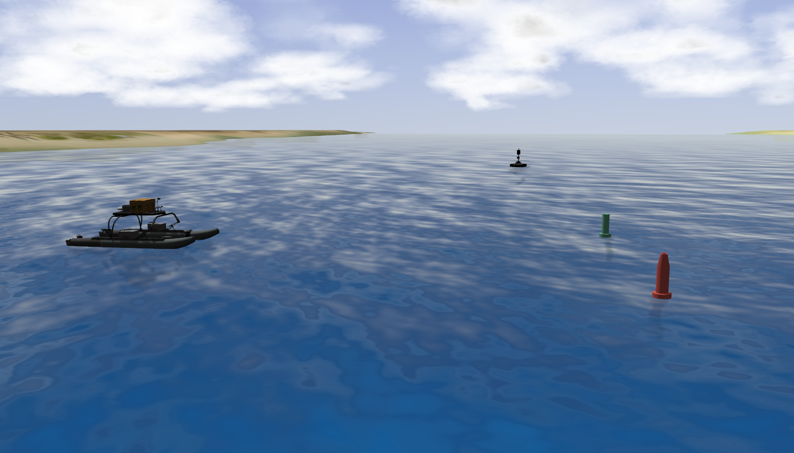

**Figure2: Ground truth of the start gate**

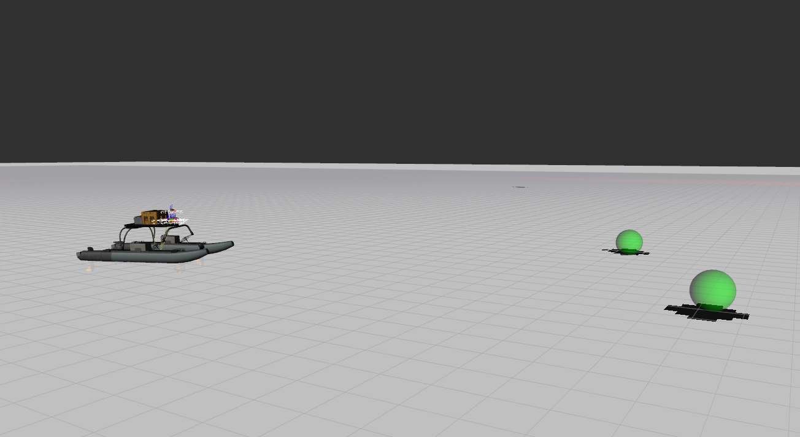

**Figure3: Provided distributions from the mock low level perception node**

The green spheres seen in Figure3 are visual representations of the 3-D Gaussians given by the mock low level perception node.

**NOTE: There are two more bouys further in front of NaviGator but not pictured. They have identical covariances given by the mock low level perception interface**

These distributions will converge to much smaller distributions over time (as seen in Figure4) due to the repeated republishing of distributions and subsequent "mergings''(multiplications against each other) from being so similar. The reason they do not converge to be infinitely small is the *covariance growth factor* is making sure that the stored distribution increases in size every quantum.

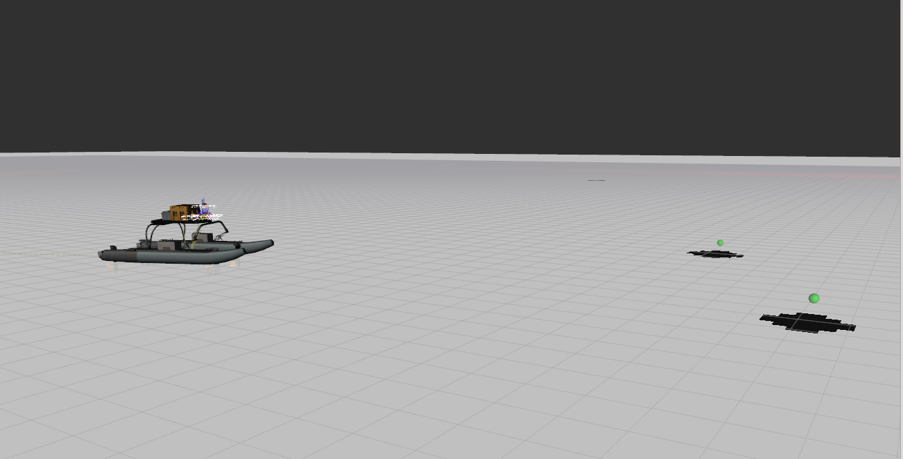

**Figure4: Distributions at Convergence**

We can use the distributions to filter the camera image.

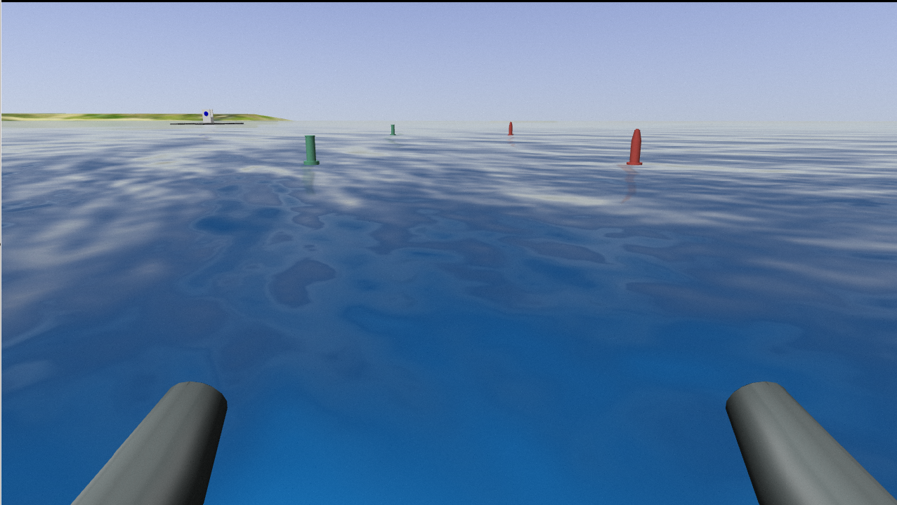

**Figure5: Camera (unfiltered)**

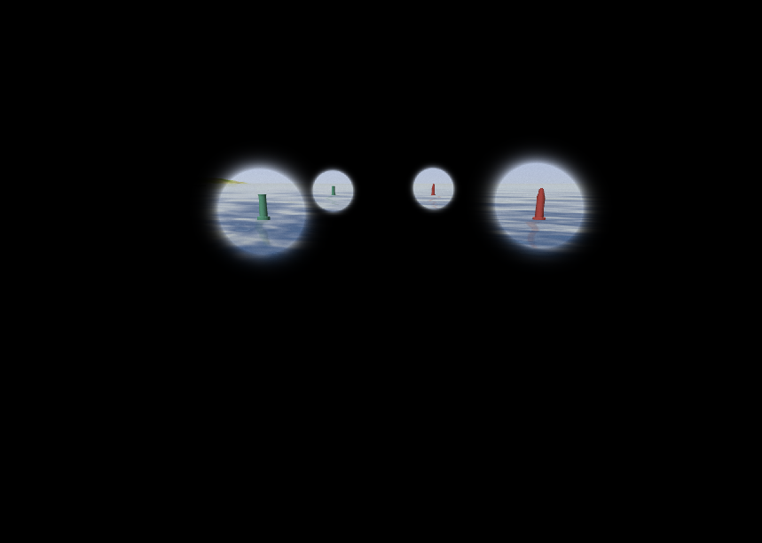

**Figure6: Camera (filtered with distributions)**

**NOTE: this is not a direct projection of the distributions onto the camera. The covariances have been "enlarged" and "brightened" to make the filtered camera data more useful**

Scan and  Dock Challenge
^^^^^^^^^^^^^^^^^^^^^^^^

The next hardest challenge is dealing with the large dock. What makes the dock exceptionally difficult to deal with in the Lidar data is its low profile to the water. This causes a large variance in the number of points returned from the Lidar with respect to time as the dock rises and falls with the surface of the water relative to the boat.

MIL currently has a piece of "higher level perception" software called Point Cloud Object Detection and Recognition (PCODAR), but it is limited in its capabilities due to its 100% reliance on Lidar.

However, if we use the Unified Perception Interface to feed it a point cloud filtered by Gaussians of detected objects by other sensors, we can enhance its capabilities.

.. image:: ./pictures/approaching_dock_gazebo.GIF

**Figure7: Approaching the dock ground truth (speed up)**

**NOTE: The tower in between the boat and the dock has no distribution associated with it (on purpose).**

.. image:: ./pictures/approaching_dock_pcodar_unfiltered.GIF

**Figure8: Approaching the dock PCODAR classifications (speed up)**

It can be seen that when PCODAR is close to the large object, it can get a fairly good representation of it. However, at a distance its modeling of the object is "noisy".

.. image:: ./pictures/approaching_dock_pcodar_filtered.GIF

**Figure9: Approaching the dock PCODAR on a filtered point cloud from Unified Perception Interface (speed up)**

It can be seen that the PCODAR's output is more consistent when using the Lidar data after it has been filtered by the Unified Perception Interface.

It should be noted that points within a *safety radius* of the boat are also passed to PCODAR. This is so that the boat will not run into objects that are not detected. This is why the boat did not run into the tower on the way to the dock.

It is also worth noting that in real world testing and in competition, we frequently have human operators working on the field elements from kayaks while we are running the boat. These operators can actually be a real problem as PCODAR will detect them and end up retaining "phantom" objects that get in the way later even though the boat never came close to them.

It is also worth noting the PCODAR never actually got a full model of the dock when running on the filtered point cloud due to this limited safety radius. This could be expanded, but at the cost of "noiser" PCODAR results.

**These demonstrations can be recreated with** ``navigator_launch vrx.launch``, ``unified_perception example.launch``, ``unified_perception unified_perception.rviz``

**In order to run PCODAR on the Unified Perception filtered Lidar data, you must remap the** ``/velodyne_points`` **topic in** ``navigator_launch vrx_pcodar.launch`` **from its normal value:** ``/wamv/sensors/lidars/lidar_wamv/points`` **to the appropriate value (default appropriate value:** ``/unified_perception/debug/point_cloud`` **)**

Drawbacks
^^^^^^^^^

There are two major drawbacks:

* Additional Latency.

  Centralizing all the perception measurements means that there will be an increase in latency as the data that is fed in will be filtered and published at a maximum 1 quantum later. For some applications this is not acceptable.

  To remedy this, there are two possible solutions:

    * go around the unified perception interface altogether for sensor data that is known to be especially time sensitive. However, this may reintroduce the same modularity issues discussed earlier.

    * have several "unified perception interfaces" which handle different sensor data / different low level perception that are known to be especially time sensitive. However, this may limit the accuracy of the individual perception interfaces.

* Not many possible distributions.

  * Currently the only distribution that is supported is a 3-D Gaussian
  * This can be remedied with additional development

Future Work
***********

The next thing that should be added / modified are:

* Add imaging sonar / apply on SubjuGator

  * SubjuGator could also benefit from this utility with the fusion of its imaging sonar and cameras

* Add an extrapolated Gaussian distribution

  * I was strongly considering adding an additional "extrapolated Gaussian" meant to extrapolate a Gaussian distribution from a camera into 3-D space with no assumption of the depth.
    The works as follows in figure 10 (assuming a 1d pinhole camera on a 2-D space):

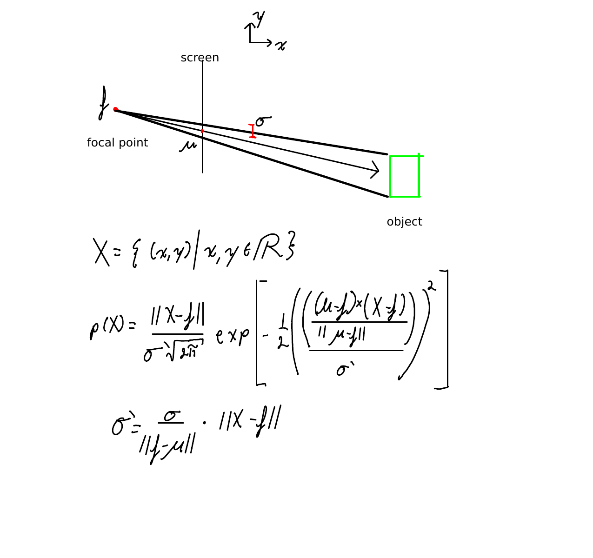

**Figure10: Extrapolated Gaussian Mathematics**

When plotted, you get as follows in figure 11 and 12. With the red point to the left being ``f`` and the other red point being ``mu``.

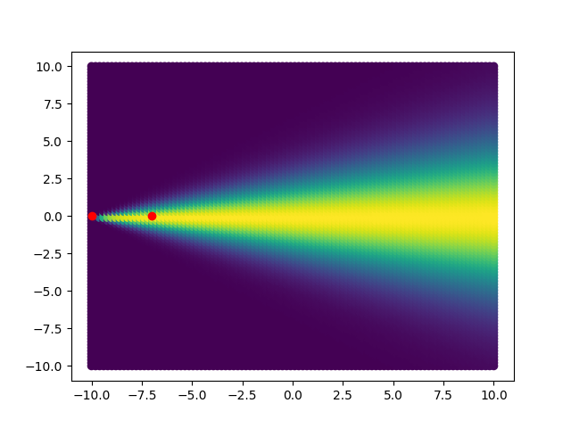

**Figure11: Extrapolated Gaussian Plot (color indicates probability)**

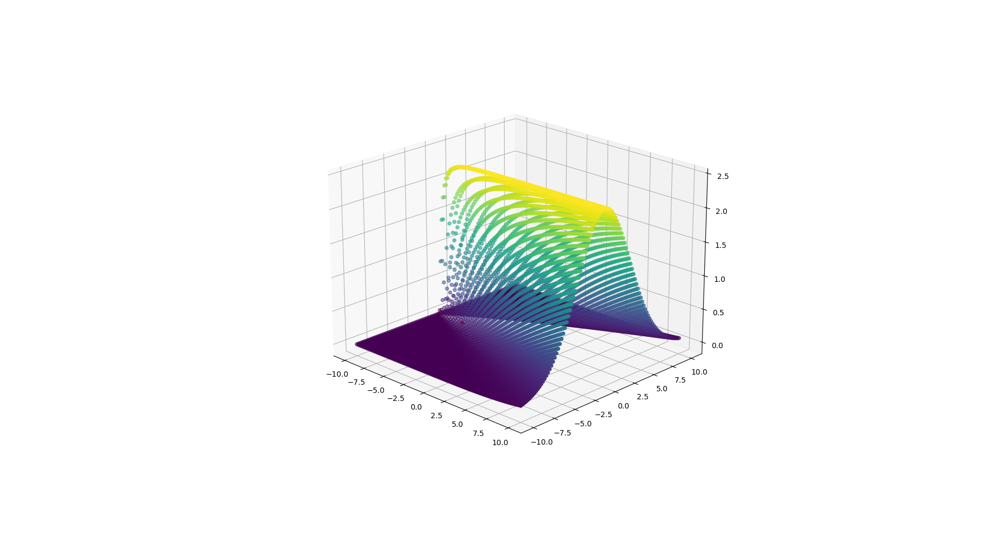

**Figure12: Extrapolated Gaussian Plot in 3-D (height indicates probability)**

Also, when multiplying two of these distributions, you can get a meaningful surface indicating a probability from multilateration (Figure13, Figure14, Figure15). However, it is not clear how to do this in a computationally efficient way (preferably analytically).

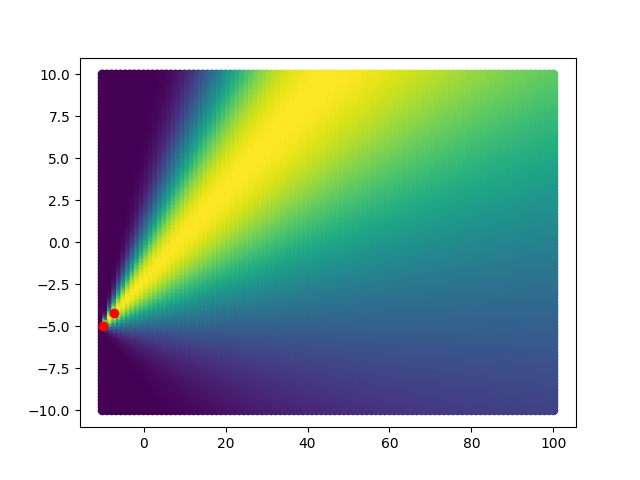

**Figure13: Extrapolated Gaussian Plot in 2-D from a theoretical camera: P0(x)**

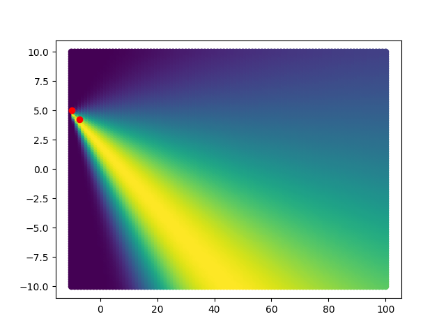

**Figure14: Extrapolated Gaussian Plot in 2-D from a theoretical camera: P1(x)**

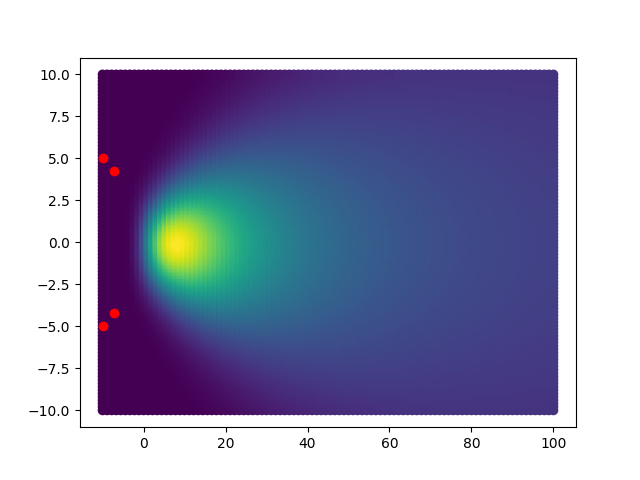

**Figure15: Extrapolated Gaussian Plot in 2-D from a theoretical camera: P2(x) = P0(x) * P1(x)**

**NOTE: all these plots were generated with** ``unified_perception extrapolated_gaussians_docs.py``

