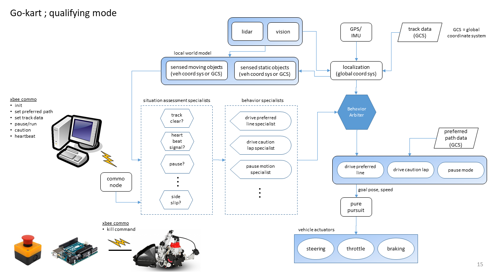

Autonomy Architecture
=====================

GO-Kart
-------
The Go-Kart will be a waypoint following autonomy. The optimal racing line will
be supplied aprior and the vehicle will attempt to track the provided racing
line.

Indy Light Vehicle
------------------
In addition to tracking a optimal racing line, the indy light autonomy must
also contend with other autonomous racers. This will require decision making
and obstacle avoidance behavior.
