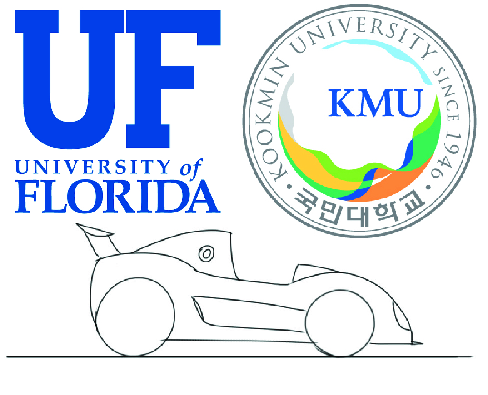

Indy AV
=====================
Welcome to team Gator Double Dragon's documentation. The team is a collabortaion
between the University of Florida and Kookmin University for the
`Indy Autonomous Challenge <https://www.indyautonomouschallenge.com/>`_.

Collaborators
-------------

`Center for Intelligent Machines and Robotics <https://cimar.mae.ufl.edu/>`_, CIMAR

`Machine Intelligence Laboratory <https://www.mil.ufl.edu/>`_, MIL

`Nonlinear Controls and Robotics Lab <http://ncr.mae.ufl.edu/index.php?id=ncr>`_, NCR

.. toctree::
   :maxdepth: 1
   :caption: Links

   Onboarding <onboarding>
   Autonomy Architecture <autonomy_architecture>
   Hardware <hardware/hardware>
   Software <software/software>

